# Jarkom-Modul-2-ITB06-2022

Repository ini dibuat sebagai laporan resmi untuk pengerjaan [Soal Shift Modul 2](https://docs.google.com/document/d/11Mz2Fd3DKtGkCknHee9VZRdJYvZ3YAMIaifObHEpBFo/edit) dari praktikum Mata Kuliah Komunikasi Data dan Jaringan Komputer.

Repository ini dibuat oleh:  

**Kelompok ITB06**
- Sarah Hanifah Pontoh	5027201006
- Sharira Saniane 	    5027201016
- Naufal Dhiya Ulhaq 	5027201029

## Pembukaan soal 
Twilight (〈黄昏 (たそがれ) 〉, <Tasogare>) adalah seorang mata-mata yang berasal dari negara Westalis. Demi menjaga perdamaian antara Westalis dengan Ostania, Twilight dengan nama samaran Loid Forger (ロイド・フォージャー, Roido Fōjā) di bawah organisasi WISE menjalankan operasinya di negara Ostania dengan cara melakukan spionase, sabotase, penyadapan dan kemungkinan pembunuhan. Berikut adalah peta dari negara Ostania:

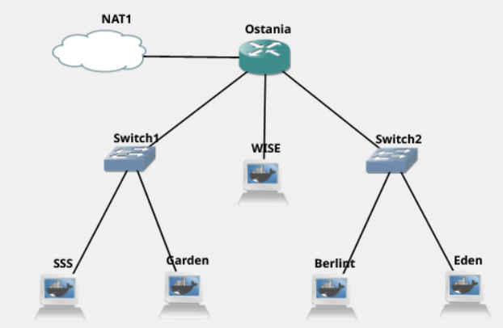

## Soal 1
WISE akan dijadikan sebagai DNS Master, Berlint akan dijadikan DNS Slave, dan Eden akan digunakan sebagai Web Server. Terdapat 2 Client yaitu SSS, dan Garden. Semua node terhubung pada router Ostania, sehingga dapat mengakses internet

### Jawaban Soal 1
Kami membuat topologi telebih dahulu sebagai berikut : 

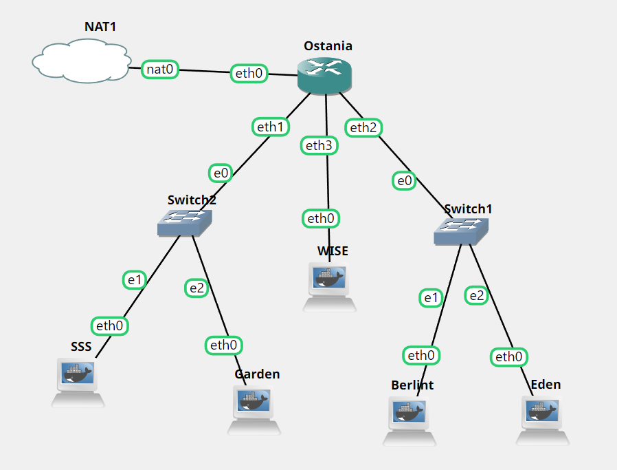

Langkah berikutnya kami akan melakukan konfigurasi pada setiap node yang ada :

* Ostania sebagai router 
```
auto eth0
iface eth0 inet dhcp

auto eth1
iface eth1 inet static
	address 192.217.1.1
	netmask 255.255.255.0

auto eth2
iface eth2 inet static
	address 192.217.2.1
	netmask 255.255.255.0

auto eth3
iface eth3 inet static
	address 192.217.3.1
	netmask 255.255.255.0
```
* SSS
```
auto eth0
iface eth0 inet static
	address 192.217.1.2
	netmask 255.255.255.0
	gateway 192.217.1.1
```
* Garden
```
auto eth0
iface eth0 inet static
	address 192.217.1.3
	netmask 255.255.255.0
	gateway 192.217.1.1
```
* Berlint
```
auto eth0
iface eth0 inet static
	address 192.217.2.2
	netmask 255.255.255.0
	gateway 192.217.2.1
```
* Eden
```
auto eth0
iface eth0 inet static
	address 192.217.2.3
	netmask 255.255.255.0
	gateway 192.217.2.1
```
* WISE
```
auto eth0
iface eth0 inet static
	address 192.217.3.2
	netmask 255.255.255.0
	gateway 192.217.3.1
```
melakukan testing dengan sebagai berikut 


## Soal 2
Untuk mempermudah mendapatkan informasi mengenai misi dari Handler, bantulah Loid membuat website utama dengan akses wise.yyy.com dengan alias www.wise.yyy.com pada folder wise

### Jawaban Soal 2
**Server WISE**

penjelasan)

``/etc/bind/named.conf.local``

```
zone "wise.itb06.com" {
        type master;
        file "/etc/bind/wise/wise.itb06.com";
};
```

**Testing tanpa SSS**
Saat kita melakukan testing menjalankan perintah 
``ping wise.itb06.com``

Berikut merupakan hasil dokumentasinya saat testing berjalan 

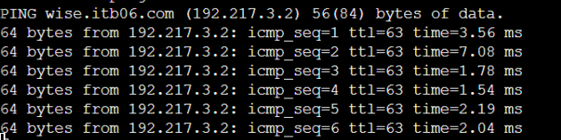

## Soal 3
Setelah itu ia juga ingin membuat subdomain eden.wise.yyy.com dengan alias www.eden.wise.yyy.com yang diatur DNS-nya di WISE dan mengarah ke Eden

### Jawaban Soal 3

langkah langkah

**Testing pada SSS**

dengan menjalankan perintah 

``ping eden.wise.itb06.com``

Berikut merupakan hasil dokumentasinya saat testing berjalan 

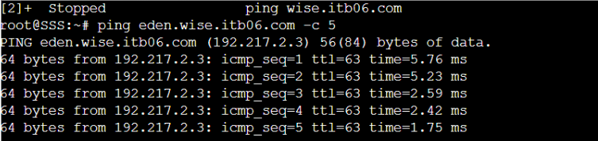

dan menjalankan perintah 

``ping www.eden.wise.itb06.com``

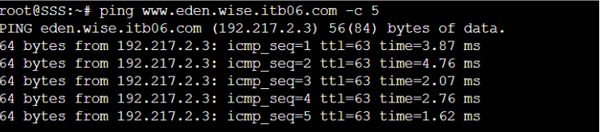

## Soal no 4
 Buat juga reverse domain untuk domain utama

 (penyelasaian )


**Testing pada SSS**

dengan menjalankan perintah 


``host -t PTR 192.217.3.2``

berikut dokumentasinya :

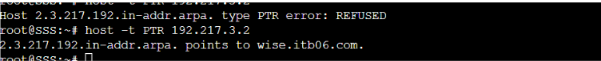

## Soal 5 

Agar dapat tetap dihubungi jika server WISE bermasalah, buatlah juga Berlint sebagai DNS Slave untuk domain utama 

(penyelasaian )

**Testing pada SSS**

Perintah yang di jalankan 

``ping wise.itbo6.com``

berikut dokumentasinya :

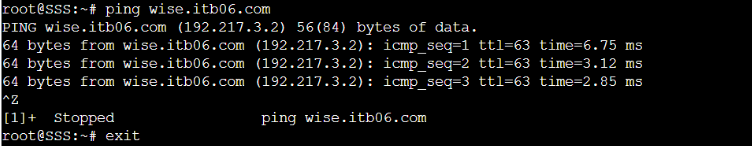

## Soal no 6 

Karena banyak informasi dari Handler, buatlah subdomain yang khusus untuk operation yaitu operation.wise.yyy.com dengan alias www.operation.wise.yyy.com yang didelegasikan dari WISE ke Berlint dengan IP menuju ke Eden dalam folder operation 

### Jawaban soal no 6

penjelasannya soon 

**Testing pada SSS**

Perintah yang di jalankan 

``ping operation.wise.itb06.com``

berikut dokumentasinya 

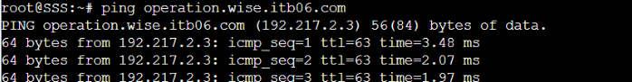

dan perintah yang di jalankan 

``ping www.operation.wise.itb06.com``

berikut dokumentasinya 

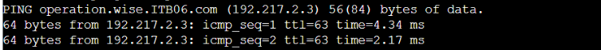


## Soal no 7

Untuk informasi yang lebih spesifik mengenai Operation Strix, buatlah subdomain melalui Berlint dengan akses strix.operation.wise.yyy.com dengan alias www.strix.operation.wise.yyy.com yang mengarah ke Eden

## Jawaban soal no 7 

penjelasan soon

**Testing pada SSS**
Perintah yang di jalankan 

``host -t CNAME www.strix.operation.wise.itb06.com``

berikut dokumentasinya 

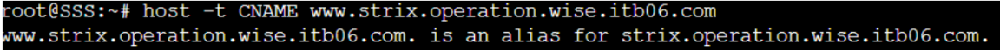

kemudian 

``ping strix.operation.wise.itb06.com``

berikut dokumentasinya 

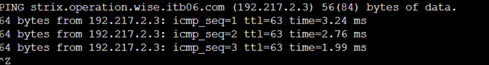

dan terakhir menjalankan perintah 

``host -t A strix.operation.wise.itb06.com``

berikut dokumentasinya 

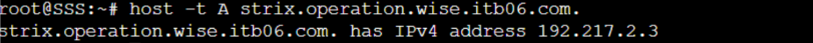

## Soal no 8 

Setelah melakukan konfigurasi server, maka dilakukan konfigurasi Webserver. Pertama dengan webserver www.wise.yyy.com. Pertama, Loid membutuhkan webserver dengan DocumentRoot pada /var/www/wise.yyy.com

### Jawaban soal no 8 

**Client SSS**
Langkah pertama, lakukan ``apt-get update`` dan menginstall lynx dengan cara sebagai berikut : 

```
apt-get update
apt-get install lynx -y
```

**Server WISE**
Pada server lakukan instalasi Apache, php, openssl untuk melakukan download ke website https dengan cara sebagai berikut : 

```
apt-get install apache2 -y
service apache2 start
apt-get install php -y
apt-get install libapache2-mod-php7.0 -y
service apache2 
apt-get install ca-certificates openssl -y
```

Setelah itu lakukan konfigurasi file ``/etc/apache2/sites-available/wise.itb06.com.conf``. DcumentRoot diletakkan di /vwr/www/wise.itb06.com. dan jangan lupa untuk menambahkan serverneme dan serveraliass

```
<VirtualHost *:80>
        ServerAdmin webmaster@localhost
        DocumentRoot /var/www/wise.ITB06.com
        ServerName wise.ITB06.com
        ServerAlias www.wise.ITB06.com
        <Directory /var/www/wise.ITB06.com/>
                Options +Indexes
        </Directory>
 
        Alias \"/home\" \"/var/www/wise.ITB06.com/index.php/home\"
</VirtualHost>
```

Lalu lakukan membaut sebuah direkroti root untuk server wise.itb06.com dan melakukan copy file content

```
mkdir /var/www/wise.itb06.com
cp -r /root/Praktikum-Modul-2-Jarkom/wise/. /var/www/wise.itb06.com
service apache2 restart
```

**Testing pada SSS**

Perintah yang di jalankan 

``lynx wise.ITB06.com``

output : 

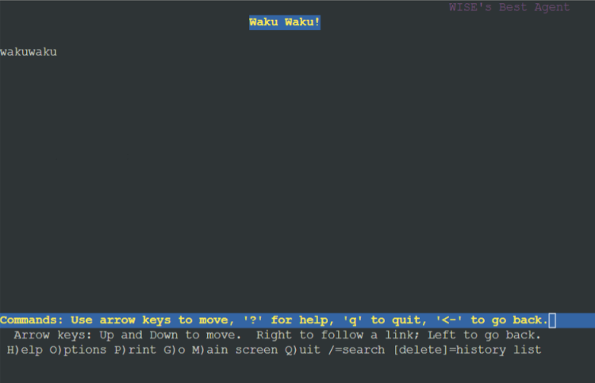

``lynx www.wise.ITB06.com``

output : 


## Soal no 9 
Setelah itu, Loid juga membutuhkan agar url www.wise.yyy.com/index.php/home dapat menjadi menjadi www.wise.yyy.com/home 

### Jawaban soal no 9 

**Server WISE**
Selanjutnya kami menambahkan syntax sebagai berikut ``/etc/apache2/sites-available/wise.itb06.com.conf``

``Alias \"/home\" \"/var/www/wise.ITB06.com/index.php/home\"``

untuk membuat ``/index,php/home`` akan berpindah ke /home saja


**Testing pada SSS**

Perintah yang di jalankan 

``lynx www.wise.itb06.com/home``

output : 


## Soal no 10 

Setelah itu, pada subdomain www.eden.wise.yyy.com, Loid membutuhkan penyimpanan aset yang memiliki DocumentRoot pada /var/www/eden.wise.yyy.com

### Jawaban soal no 10

Langkah pertama membuat sebuah directory di dalam ``/var/www/`` dengan nama eden.wise.itb06.com, setelah file di download akan langsung diunzip menggunakan command unzip dan memindahkan isi folder yang berupa asset lalu menghapus folder defaultnya. Di dalam ``/etc/apache2/sites-available/wise.ITB06.com.conf``

```
        ServerAdmin webmaster@localhost
        DocumentRoot /var/www/Eden.wise.ITB06.com
        ServerName Eden.wise.ITB06.com
        ServerAlias www.Eden.wise.ITB06.com
```
Hal ini membuat DocumentRoot dari subdomain ``www.eden.wise.itb06.com``akan terletak di ``/var/www/eden.wise.itb06.com.`` 

**Testing pada SSS**

Perintah yang di jalankan 

``lynx eden.wise.ITB06.com``

output : 

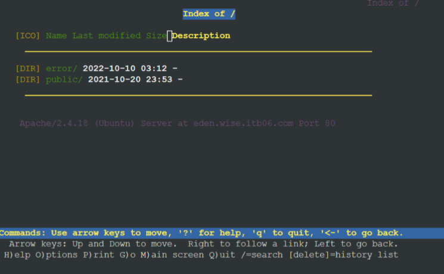

## Soal no 11

Akan tetapi, pada folder /public, Loid ingin hanya dapat melakukan directory listing saja

### Jawaban soal no 11

**WISE**
membuat directory listing dengan menambahkna konfigurasi di ``/etc/apache2/sites-available/Eden.wise.ITB06.com.conf``

```
        <Directory /var/www/Eden.wise.ITB06.com/public>
                Options +Indexes
        </Directory>

```


**Testing pada SSS**

Perintah yang di jalankan 

``lynx eden.wise.ITB06.com/public``

output : 

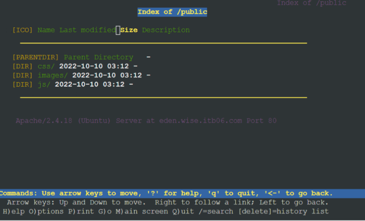

## Soal no 12

Tidak hanya itu, Loid juga ingin menyiapkan error file 404.html pada folder /error untuk mengganti error kode pada apache

### Jawaban soal no 12

**WISE**
Pada Wise edit konfigurasi terlebih dahulu pada ``/etc/apache2/sites-available/Eden.wise.ITB06.com.conf``sebagai berikut 

```
        ErrorDocument 404 /error/404.html
        <Files \"/var/www/Eden.wise.ITB06.com/error/404.html\">
                <If \"-z %{ENV:REDIRECT_STATUS}\">
                        RedirectMatch 404 ^/error/404.html$
                </If>
        </Files>

```
Dalam file tersebut kami menambahkan ErrorDocument dan Files sehingga apabila muncul error code 404 pada web akan meredirect menuju file 404 yang sudah disiapkan yaitu ``/error/404.html``

**Testing pada SSS**

Perintah yang di jalankan 

``lynx eden.wise.ITB06.com/haloo``

output : 

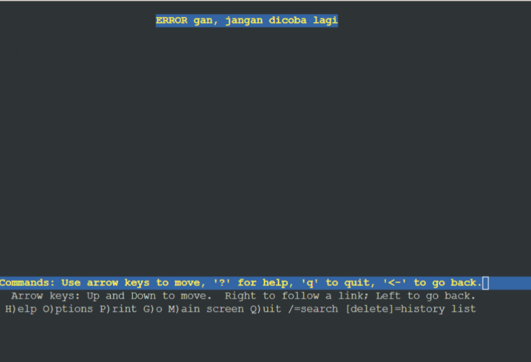

## Soal no 13

Loid juga meminta Franky untuk dibuatkan konfigurasi virtual host. Virtual host ini bertujuan untuk dapat mengakses file asset www.eden.wise.yyy.com/public/js menjadi www.eden.wise.yyy.com/js

### Jawaban soal no 13

**WISE**
Pada WISE sekali lagi di edit konfigurasi pada ``/etc/apache2/sites-available/Eden.wise.ITB06.com.conf`` sebagai berikut : 

``Alias \"/js\" \"/var/www/Eden.wise.ITB06.com/public/js\"``

Maksudnya bahwa ``Alias`` disini akan mentranslate direktori web ``/js`` menjadi ``/public/js``


**Testing pada SSS**

Perintah yang di jalankan 

``lynx eden.wise.ITB06.com/js``

output : 

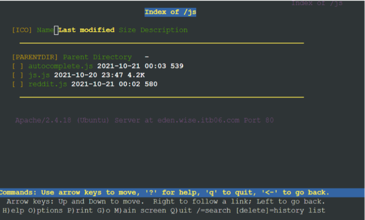

## Soal no 14 

Loid meminta agar www.strix.operation.wise.yyy.com hanya bisa diakses dengan port 15000 dan port 15500

### Jawaban soal no 14 

**WISE**
konfigurasi file ``/etc/apache2/sites-available/strix.operation.wise.ITB06.com.conf`` disini menambahkan CirtualHost baru yang berada pada port 15000 dan 15500 sebagai berikut : 

```
<VirtualHost *:15000 *:15500>
        ServerAdmin webmaster@localhost
        DocumentRoot /var/www/strix.operation.wise.ITB06.com
        ServerName strix.operation.wise.ITB06.com
        ServerAlias www.strix.operation.wise.ITB06.com
        <Directory \"/var/www/strix.operation.wise.ITB06.com\">
                AuthType Basic
                AuthName \"Restricted Content\"
                AuthUserFile /var/www/strix.operation.wise.ITB06 
                Require valid-user
        </Directory>
</VirtualHost>

```

Maka dengan begitu web www.trix.operation.wise.ITB06.com hanya akan bisa diakses dengan port 15000 dan port 15500

**Testing pada SSS**

Perintah yang di jalankan 

``lynx www.strix.operation.wise.itb06.com:1500``

output : 


## Soal no 15
Dengan autentikasi username Twilight dan password opStrix dan file di /var/www/strix.operation.wise.yyy

### Jawaban soal no 15

**WISE**
Pada wise dilakukan command

``htpasswd -b -c /var/www/strix.operation.wise.ITB06 Twilight opStrix``

Perintah tersebut berfungsi untuk mengatur basic authentication yang disimpan pada file /var/www/.strix.operation.wise.itb06 dengan username Twilight dan password opStrix

**Testing pada SSS**

Perintah yang di jalankan 

``lynx strix.operation.wise.itb06.com:1500``

output : 


## Soal no 16

dan setiap kali mengakses IP Eden akan dialihkan secara otomatis ke www.wise.yyy.com

### Jawaban soal no 16

**WISE**
Pada file ``/etc/apache2/sites-available/000-default.conf`` menambahkan 

``redirect permanent / http://wise.ITB06.com``

sehingga akan langsung meredirect www.wise,itb06.com ketika membuka IP WISE

**Testing pada SSS**

Perintah yang di jalankan 

``lynx 192.217.2.3``

output : 

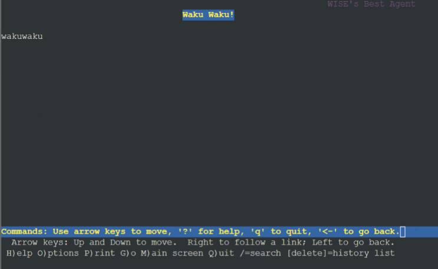

## Soal no 17

Karena website www.eden.wise.yyy.com semakin banyak pengunjung dan banyak modifikasi sehingga banyak gambar-gambar yang random, maka Loid ingin mengubah request gambar yang memiliki substring “eden” akan diarahkan menuju eden.png. Bantulah Agent Twilight dan Organisasi WISE menjaga perdamaian! 


### Jawaban soal no 17

Membuat file ``/var/www/Eden.wise.ITB06.com/.htaccess`` yang isinya sebagai berikut : 

```
RewriteEngine On
RewriteCond %{REQUEST_URI} !^/public/images/eden.png$
RewriteCond %{REQUEST_FILENAME} !-d 
RewriteRule ^(.*)eden(.*)$ /public/images/eden.png [R=301,L]
```
Kemudian pada file ``/etc/apache2/sites-available/strix.operation.wise.ITB06.com.conf`` kami tambahkan directory nya

```
         <Directory /var/www/Eden.wise.ITB06.com>
                Options +FollowSymLinks -Multiviews
                AllowOverride All
        </Directory>
```


**Testing pada SSS**

Perintah yang di jalankan 

``lynx eden.wise.ITB06.com/edening.png``

output : 

menginput nama eden.png

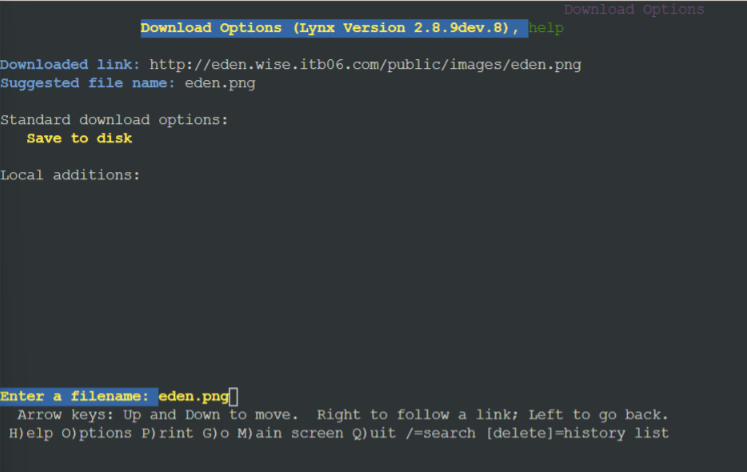

kemudian save to disk ]

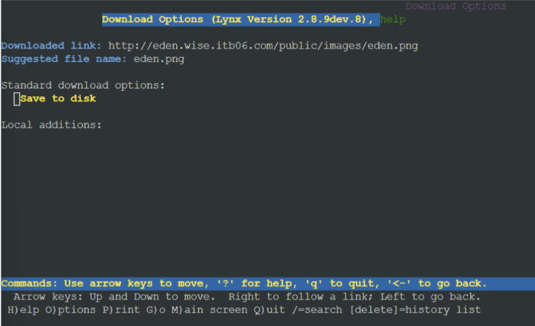

maka setelah di download maka akan didapatkan hasil sebagai berikut : 

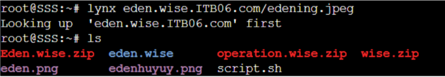
